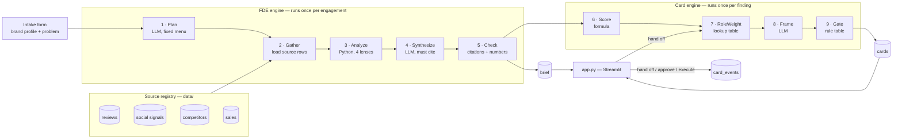
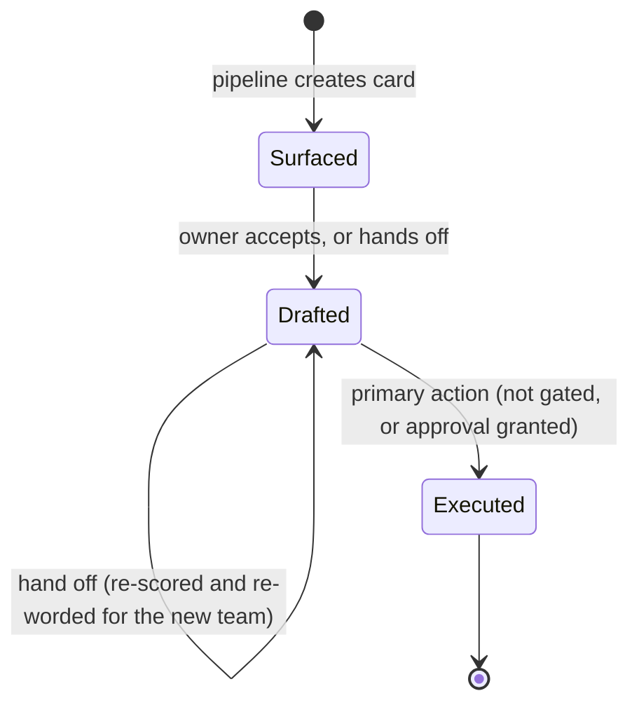
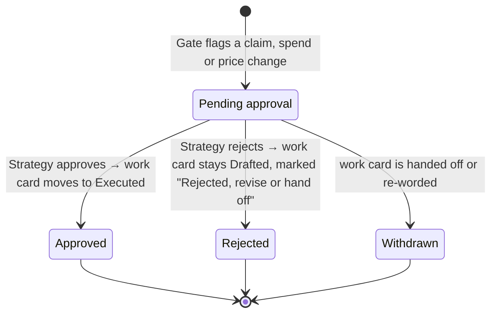
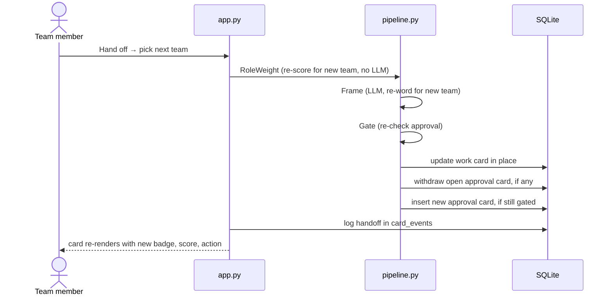

# CREWASIS — FDE in a Box

> **Hazra reads. The Intelligence Suite analyzes. Winston answers. _…the FDE diagnoses, and the right team acts._**

A hackathon prototype for **CREWASIS**, a decision-intelligence platform for consumer brands.
It adds a **mini forward-deployed engineer (FDE)** to CREWASIS. A brand describes a business problem in plain words.
The FDE studies the brand's customers, its product and its competitors. It returns a **structured brief in which every
claim links to its source**. Each recommendation then becomes an **action card owned by the right team**, and a person
approves anything risky before it happens.

**Team 2 · Case study: Instagram · Demo brand: ProForge Nutrition (fictional protein brand)**

---

## 1. The problem

Take a small protein brand. Its signals are scattered: marketplace reviews, Instagram comments, competitor product
pages and its own sales data. It has no analyst team and can't afford a consultant, so nobody connects the pieces
into *"here's what's going wrong, and why"*.

When an insight does surface, a second problem appears, and this is the **Instagram case study** lesson. Meta Business
Suite gives the people on one account different roles (Admin, Editor, Moderator, Analyst), but **Instagram's
recommendations treat the whole account as one person**. Everyone sees the same feed. A brand's **Marketing,
Insights, R&D and Strategy** teams have the same risk inside CREWASIS. If every team gets the same insight with the
same wording, nobody owns it and nobody acts on it.

So there are two gaps:
1. **Diagnosis:** *"Why are our sales falling, and what are competitors doing differently?"*
2. **Ownership:** *"Who does what about it, and who signs off?"*

## 2. The idea in one sentence

> **A brand describes its problem. CREWASIS's FDE analyses customers, product, competitors and channels, and returns a
> sourced brief. Every recommendation becomes a card owned by the right team, and anything risky needs a person to
> approve it first.**

From Instagram we keep two things it gets right: **scoring from many signals** and **fast, visible feedback**.
We avoid its blind spot of **treating the account, not the person, as the unit**.

### Example engagement (the demo)

> **ProForge asks:** *"Online sales of our protein bars fell 20% this quarter, and repeat purchase dropped from 38% to
> 29%. Why, and what should we do?"*

| Lens | What the FDE finds (from the synthetic demo data) | Becomes a card for |
|---|---|---|
| **Where the product is failing** | Texture is now the top complaint: 34% of 1–2★ bar reviews say "chalky" or "dry", up from 22.5% last quarter | R&D |
| **Competitor pricing** | ProForge costs ₹6.0 per gram of protein; CleanBar Co costs ₹5.0, so ProForge is 20% more expensive | Strategy |
| **Competitor positioning** | 2 of 3 competitors lead with "no added sugar"; ProForge only says "high protein", and sugar is the most-asked question on Instagram | Marketing |
| **Customer discovery** | Requests for a plant-protein bar are up 83% this quarter, mostly from vegetarian buyers, who rate ProForge lowest | Insights |
| **Channel** | Marketplace units are down 28%; two competitors sell on quick-commerce apps where ProForge isn't listed | Marketing |
| **Packaging** | 12% of 1–2★ reviews say the bar melted or the wrapper tore in delivery | R&D |

Every number in that table is calculated by Python from a source row, not written by the LLM. See [§7](#7-where-every-answer-comes-from).

---

## 3. How this maps to the judging criteria

| Criterion | Weight | What earns the points in this build |
|---|---|---|
| **Vision** | 30% | Extends CREWASIS's own story (Hazra → Intelligence Suite → Winston) with a diagnosis step and **"the right team acts"**. Any brand can bring any problem, not only look at a dashboard. Clear roadmap from synthetic demo to live connectors and self-learning weights ([§13](#13-roadmap)). Humans approve at every stage. |
| **Customer impact** | 25% | A brand without an analyst team gets a consultant-style brief in minutes. Every recommendation ends in **an action with an owner**, not a chart. Every claim links to the rows it came from. A metrics bar shows findings actioned, approvals waiting and hand-offs needed to reach execution. |
| **Feasibility** | 15% | Runs end to end on a laptop with SQLite and Streamlit. All numbers come from plain Python you can check by hand. About 10 LLM calls per engagement, and the demo engagement is cached. **Offline mode** falls back to templates if there's no API key or the LLM fails. |
| *Remaining 30%* | — | Check the Hackathon Brief for the other criteria (likely innovation and demo/storytelling). The pitch order in [§12](#12-demo-script-5-minutes) follows the brief's five deliverables. |

---

## 4. System overview



The engine is split into three layers so it can grow without being rewritten:

| Layer | Its job | How it grows |
|---|---|---|
| **Sources** | Load raw rows and give each one a stable id (`R014`, `P03`…) | Add a source = add one row to `data/sources.csv` and one loader. Nothing downstream changes. |
| **Lenses** | Turn rows into **facts**: numbers calculated by Python, each listing the row ids it used | Add a lens = add one file in `fde/lenses/` with a `run(evidence) -> list[Fact]` function and register it. |
| **Cards** | Turn facts into owned, approved actions | Unchanged from the original card engine, with the fixes listed in [§9](#9-card-lifecycle-how-work-moves-between-teams). |

| Layer | Tech | Why |
|---|---|---|
| Data | 4 synthetic CSVs plus a source registry | There's no real marketplace or Instagram API access. Synthetic data is expected, and we say so in the pitch. |
| Storage | SQLite via built-in `sqlite3` | A single file with no server and no ORM. |
| Pipeline | LangGraph, 9 small steps | Each step does one job and can be checked on its own. It is not a multi-agent system. |
| LLM | OpenAI API behind a thin wrapper, swappable to Anthropic | Used for **planning and wording only** (Plan, Synthesize, Frame). Never used to compute a number, rank or approve. |
| UI | Streamlit | Three screens: Ask the FDE, Brief, Team board. |
| Retrieval | None: the relevant rows and facts go straight into the prompt | With a few hundred rows, a vector database adds risk and no value. |

---

## 5. Project structure

```
.
├── app.py                  # Streamlit: Ask the FDE · Brief · Team board
├── pipeline.py             # LangGraph graph (9 steps), LLM wrapper, offline templates
├── fde/
│   ├── planner.py          # Plan: problem → lenses + questions (fixed menu)
│   ├── gather.py           # Gather: load rows from the source registry into `evidence`
│   ├── lenses/
│   │   ├── customer.py     # customer discovery: segments, unmet needs
│   │   ├── product.py      # where the product fails: complaint themes, trends, packaging
│   │   ├── competitor.py   # pricing per unit of value, positioning claims, packaging
│   │   └── channel.py      # sales and repeat rate by channel, where competitors sell
│   └── synthesize.py       # brief writer + citation check
├── scoring.py              # score formula, role weights, gate rules, check_numbers, check_citations
├── db.py                   # SQLite schema, CSV load, read/write helpers
├── data/
│   ├── sources.csv         # source registry: one row per data source
│   ├── reviews.csv         # ~150 ProForge reviews
│   ├── social_signals.csv  # ~60 Instagram / Reddit / YouTube signals
│   ├── competitors.csv     # ProForge + 3 competitors, bar and whey products
│   └── sales.csv           # 12 months of ProForge sales by product and channel
├── requirements.txt
└── README.md
```

---

## 6. Data model

### Source files (all synthetic, all fictional brands)

| File | Id prefix | Key columns | Confidence |
|---|---|---|---|
| `reviews.csv` | `R` | `product` (bar/whey) · `channel` · `rating` 1–5 · `text` · `reviewer_segment` (gym_regular, beginner, weight_loss, vegetarian, endurance) · `date` | 0.90 |
| `social_signals.csv` | `S` | `platform` · `signal_type` (question, complaint, praise, request, competitor_mention) · `text` · `mention_count` · `velocity_pct` · `date` | 0.70 |
| `competitors.csv` | `P` | `brand` · `product` · `format` · `price_inr` · `servings` · `protein_g_per_serving` · `sugar_g_per_serving` · `claims` · `packaging` · `channels` · `date_checked` | 0.95 |
| `sales.csv` | `M` | `month` · `product` · `channel` · `units` · `repeat_rate` | 1.00 |

`sources.csv` lists each file with its name, description, collection date, `synthetic = yes` and the confidence above.
**Confidence belongs to the source, not the finding.** Sales data is exact; social chatter is noisy.

### Tables

| Table | What it holds | Key columns |
|---|---|---|
| `sources` | the source registry | `prefix`, `name`, `file`, `collected_at`, `synthetic`, `confidence` |
| `evidence` | every source row, unchanged | `id` (`R014`), `source_prefix`, `raw` (JSON of the CSV row), `date` |
| `engagements` | one per problem a brand asks about | `id`, `brand`, `problem`, `plan` (JSON), `status`, `created_at` |
| `facts` | numbers calculated by the lenses | `id` (`F1`), `engagement_id`, `lens`, `category`, `magnitude`, `change_pct`, `confidence`, `evidence_ids` (JSON), `computation` (JSON: every input and step) |
| `brief_sections` | the written brief | `engagement_id`, `section`, `text`, `cited_ids` (JSON), `check_status` (`passed` / `fell_back`) |
| `cards` | action cards | see below |
| `card_events` | every move a card makes | `card_id`, `event`, `from_role`, `to_role`, `from_state`, `to_state`, `at` |

### `cards`

| column | type | notes |
|---|---|---|
| `id` | INTEGER PK | |
| `engagement_id` | INTEGER FK → `engagements.id` | |
| `fact_id` | TEXT FK → `facts.id` | links back to the fact, and through it to the source rows |
| `kind` | TEXT | `work` or `approval` |
| `parent_card_id` | INTEGER FK → `cards.id`, nullable | set on approval cards; points to the work card being approved |
| `owner_role` | TEXT | `Marketing` · `Insights` · `R&D` · `Strategy` |
| `state` | TEXT | work: `Surfaced` · `Drafted` · `Executed` — approval: `Pending approval` · `Approved` · `Rejected` · `Withdrawn` |
| `relevance_score` | REAL | 0–1, already weighted for `owner_role` |
| `evidence` | TEXT | the cited finding sentence |
| `suggested_action` | TEXT | next step worded for the owning team |
| `requires_approval` | BOOLEAN | set by the Gate |
| `created_at`, `updated_at` | TIMESTAMP | |

`card_events.event` is one of `created` · `drafted` · `handoff` · `approval_requested` · `approved` · `rejected` · `withdrawn` · `executed`.

---

## 7. Where every answer comes from

The question to answer is: *"The analysis was done by a model, but what did it use?"*
The answer is that **the model never produces a number**. It plans, and it writes sentences about facts that code
has already calculated.

| Step | Done by | Can it invent anything? |
|---|---|---|
| Choose which lenses to run | LLM, from a fixed menu of 4 | No. Unknown lenses are dropped. |
| Load the data | Python | No. Rows are copied unchanged. |
| Calculate every number | Python | No. Each fact stores its inputs and its formula. |
| Write the brief | LLM | It could try, so the **Check** step rejects any sentence that fails the rules below. |
| Rank, route and approve | Python + a person | No. It uses the formula, the weight table and the gate rules. |

### The Check step

Every sentence in the brief must pass two checks:
1. **`check_citations()`:** the sentence cites at least one id in square brackets (`[F1]`, `[R014]`), and every cited
   id exists in this engagement.
2. **`check_numbers()`:** every number in the sentence appears in a cited fact or row. Numbers are compared as
   values after normalising, so `+47%`, `47%` and `47 %` match, `0.91` matches `91%`, and `₹1,200` matches `1200`.
   A value may be rounded to one decimal place.

If a sentence fails either check, it is replaced by the **template sentence** for that fact, and the section is
marked `fell_back`. **No uncited claim and no made-up number reaches the screen.** The brief header shows the check
result, for example *"Citation check: 11 of 11 sentences passed"*.

### The "Sources used" panel

At the bottom of every brief:
- **Per source:** file name, description, collection date, **synthetic: yes**, rows loaded and rows cited.
- **Per finding:** click a citation to open the exact rows, plus the fact's formula with every input filled in.
- **Gaps:** questions from the plan that no source could answer, for example *"No offline retail data, so gym-store
  sales weren't checked."* Saying what wasn't checked is part of being trustworthy.

---

## 8. Pipeline: from a problem to owned actions

### FDE engine (once per engagement)

**Step 1 · Plan (LLM, JSON output)**
- **In:** the brand profile (category, products, price points, channels, named competitors) and the problem text.
- **Out:** `{ "lenses": ["product", "competitor", ...], "questions": ["..."], "products": ["bar"] }`
- **Guardrail:** lenses must come from the fixed menu `customer · product · competitor · channel`. Unknown lenses are
  dropped. If none are left, all four run.

**Step 2 · Gather (Python)**
Loads the rows each chosen lens needs from the source registry, filtered to the products in the plan.

**Step 3 · Analyze (Python, one module per lens)**
Each lens returns facts. A fact has a `magnitude` (0–1), a `change_pct` (how that magnitude moved against the
previous quarter, or 0 if there is no earlier period), the source `confidence`, and the list of row ids it used.

| Lens | Facts it calculates | Category |
|---|---|---|
| **Customer discovery** | share of reviewers by segment and average rating per segment; unmet needs (count of `request` signals by need) and their trend | `customer` |
| **Where the product fails** | share of 1–2★ reviews by complaint theme and its trend. Themes are assigned by keyword rules (`chalky`, `dry`, `gritty` → texture), which you can read in `product.py` | `product`, `packaging` |
| **Competitors** | price per gram of protein and the gap to each competitor; which claims each brand makes (such as "no added sugar", "clean label", "vegan") and which claims nobody makes; packaging formats | `pricing`, `positioning`, `packaging` |
| **Channel** | units and repeat rate by channel, quarter over quarter; channels where competitors sell and ProForge doesn't | `channel` |

> **Not protein-specific:** "price per gram of protein" comes from `value_unit: protein_g` in the brand profile.
> A skincare brand would use `value_unit: ml`, and a coffee brand `value_unit: cup`.

**Step 4 · Synthesize (LLM)**
- **In:** the problem, the plan and all facts, with their rows.
- **Out:** the brief (see [§10](#10-ui)): findings by lens, likely root causes ranked, recommendations, and gaps.
- Each root cause gets a **confidence label by rule**, not by the model:
  **High** if at least 2 source types support it with 30 or more rows; **Medium** if 1 source type has 30 or more
  rows, or 2 source types have fewer; **Low** otherwise.

**Step 5 · Check (Python)**
Runs the citation and number checks from [§7](#the-check-step).

### Card engine (once per finding, and again on each hand-off)

**Step 6 · Score (formula)**
```
base = magnitude × (1 + clip(change_pct, −100, 100) / 100) × confidence      → clipped to 0–1
```
Every input and intermediate value is logged and shown under *"Show source & score"*.

**Step 7 · RoleWeight (lookup table)**
`relevance_score = clip(base × WEIGHTS[category][owner_role], 0, 1)`

| category | Marketing | Insights | R&D | Strategy | Default owner |
|---|---|---|---|---|---|
| product | 0.9 | 1.0 | **1.3** | 1.0 | R&D |
| packaging | 0.9 | 1.0 | **1.3** | 1.0 | R&D |
| pricing | 1.0 | 1.0 | 0.7 | **1.3** | Strategy |
| positioning | **1.3** | 1.1 | 0.8 | 1.1 | Marketing |
| customer | 1.2 | **1.3** | 0.9 | 1.0 | Insights |
| channel | **1.2** | 1.1 | 0.7 | **1.2** | Marketing |

**Step 8 · Frame (LLM)**
- **In:** the finding sentence and `owner_role`.
- **Out:** `suggested_action`, a single imperative sentence worded for that team's job:

| Team | Its job | Example action |
|---|---|---|
| Insights | check the signal is real | "Validate the plant-protein request spike against last quarter's reviews" |
| Marketing | shape what customers see | "Draft Instagram posts that lead with ProForge's 2 g sugar per bar" |
| R&D | shape the product | "Test a softer bar base to cut chalky-texture complaints" |
| Strategy | decide on money and direction | "Decide whether to close the ₹1.0 per gram of protein price gap with CleanBar Co" |

**Step 9 · Gate (rule table)**
`requires_approval = true` if `suggested_action` matches any rule. Matching uses **whole words and phrases**
(regex `\b…\b`, case-insensitive), so "compost" doesn't match "post".

| Rule | Trigger words and phrases (in `scoring.py`) | Why |
|---|---|---|
| Customer-facing claim | post, posts, caption, campaign, announce, publish, claim, label, pack copy, reply publicly | brand risk, and nutrition/health claims are regulated (e.g. FSSAI in India) |
| Budget spend | budget, spend, fund, paid, boost, sponsor, influencer, launch, listing fee | money |
| Price change | discount, price cut, reprice, offer | revenue and channel partners |

**Strategy-owned work cards are never gated.** Strategy is the approver, so a Strategy card's primary action
(*"Decide"*) is the decision itself and is logged as one. This avoids Strategy cards creating approval cards for
themselves.

### Worked example (for the judges)

**Finding:** texture complaints on the bar.
50 one- and two-star bar reviews this quarter, 17 of which mention texture. Last quarter it was 9 of 40.

```
magnitude   = 17 / 50                        = 0.340   (34%)
last qtr    = 9 / 40                         = 0.225   (22.5%)
change_pct  = (0.340 − 0.225) / 0.225 × 100  = +51
confidence  = 0.90                                     (reviews source)

base = 0.340 × (1 + 51/100) × 0.90           = 0.462

R&D        0.462 × 1.3 = 0.601   → top of the R&D view
Insights   0.462 × 1.0 = 0.462
Marketing  0.462 × 0.9 = 0.416   → lower for Marketing
```

**Finding:** price per gram of protein.
```
ProForge bar   ₹120 ÷ 20 g protein = ₹6.0 per gram   [P01]
CleanBar Co    ₹100 ÷ 20 g protein = ₹5.0 per gram   [P04]
gap            (6.0 − 5.0) / 5.0   = 20% more expensive
```

### Offline mode
If `OPENAI_API_KEY` is missing, `CREWASIS_OFFLINE=1` is set, or an LLM call fails, the LLM steps fall back to
templates in `pipeline.py`:
- **Plan:** run all four lenses.
- **Synthesize:** one template sentence per fact, e.g. `"{theme} is mentioned in {magnitude:.0%} of 1–2★ reviews, {change_pct:+}% on last quarter [{fact_id}]."`
- **Frame:** one sentence template per team and category.

The demo keeps working even without an internet connection.

---

## 9. Card lifecycle: how work moves between teams

A gated work card is **not** moved into approval itself. The Gate creates a separate **approval card** for
Strategy, and the work card waits in `Drafted` until that approval card is decided.

**Work cards**


**Approval cards (always owned by Strategy)**


| Card | State | Usually owned by | Buttons |
|---|---|---|---|
| work | **Surfaced** | whoever the category's default owner is | Accept · Hand off |
| work | **Drafted** | Marketing / R&D / Insights / Strategy | Execute (or *Decide* for Strategy) · Hand off |
| work | **Executed** | — | read-only |
| approval | **Pending approval** | Strategy | Approve · Reject |
| approval | **Approved / Rejected / Withdrawn** | — | read-only |

**Rules enforced in `app.py`:**
- A work card with `requires_approval = true` **can't be executed** until its approval card is `Approved`. Until then
  its primary button reads *"Awaiting Strategy approval"* and is disabled.
- **An approval covers the exact wording.** If a hand-off re-words the action, any open approval card is `Withdrawn`.
  If the new wording is still gated, a new approval card is created. If it isn't, the work card is unblocked.
- **Reject** leaves the work card in `Drafted` with its current owner and a "Rejected" note. The owner can hand it
  off or re-word it, which asks for approval again.
- Every change writes a row to `card_events`.

### Hand-off flow (1 LLM call)



---

## 10. UI

Three screens, switched with tabs at the top.

**Ask the FDE:** the intake form.
```
┌──────────────────────────────────────────────────────────────────────┐
│ CREWASIS · ProForge      [Ask the FDE]  Brief   Team board           │
├──────────────────────────────────────────────────────────────────────┤
│ Brand profile   Protein bars + whey · ₹120 bar · marketplace, D2C    │
│                 Competitors: CleanBar Co, MuscleMint, WheyWise        │
│ Your problem    ┌────────────────────────────────────────────────┐   │
│                 │ Online sales of our protein bars fell 20% this │   │
│                 │ quarter and repeat purchase dropped 38% → 29%. │   │
│                 │ Why, and what should we do?                    │   │
│                 └────────────────────────────────────────────────┘   │
│                                               [ Run the FDE ]        │
│ Plan: product ✓  competitor ✓  customer ✓  channel ✓                 │
└──────────────────────────────────────────────────────────────────────┘
```

**Brief:** the structured answer.
```
┌──────────────────────────────────────────────────────────────────────┐
│ CREWASIS · ProForge       Ask the FDE  [Brief]  Team board           │
├──────────────────────────────────────────────────────────────────────┤
│ Looked at: 150 reviews · 60 social signals · 9 competitor products · │
│ 12 months of sales                 Citation check: 11 of 11 passed ✓ │
├──────────────────────────────────────────────────────────────────────┤
│ FINDINGS                                                             │
│ Product     Texture is the top complaint: 34% of 1–2★ bar reviews,   │
│             up from 22.5% [F1] [R014] [R031] [R044]                  │
│ Pricing     ₹6.0 vs ₹5.0 per g of protein, 20% dearer [F2][P01][P04] │
│ …                                                                    │
│ ROOT CAUSES (ranked)                                                 │
│ 1. Texture drives 1–2★ reviews and lost repeat buyers    High        │
│ 2. Price gap on marketplaces                             Medium      │
│ RECOMMENDATIONS → 6 cards on the Team board                          │
│ WHAT WE COULDN'T CHECK   No offline / gym-store sales data           │
│ ▸ Sources used (4 files, 83 rows cited)                              │
└──────────────────────────────────────────────────────────────────────┘
```

**Team board:** role-aware cards.
```
┌──────────────────────────────────────────────────────────────────────┐
│ CREWASIS · ProForge    Ask the FDE  Brief  [Team board]  View as: R&D│
├──────────────────────────────────────────────────────────────────────┤
│ Findings 6 │ In progress 4 │ Awaiting approval 1 │ Executed 1 │      │
│ Avg hand-offs to execution 1.5 │ Citation check 100%                 │
├──────────────────────────────────────────────────────────────────────┤
│ ┌───────────────────────────────┐ ┌───────────────────────────────┐  │
│ │ [R&D] [Surfaced]         0.60 │ │ [R&D] [Surfaced]         0.14 │  │
│ │ Texture: 34% of 1–2★ reviews  │ │ Melted / torn wrapper: 12% …  │  │
│ │ → Test a softer bar base …    │ │ → Trial a foil-lined wrapper  │  │
│ │ [Accept]   Hand off: [▾] ⏎    │ │ [Accept]   Hand off: [▾] ⏎    │  │
│ │ ▸ Show source & score         │ │ ▸ Show source & score         │  │
│ └───────────────────────────────┘ └───────────────────────────────┘  │
└──────────────────────────────────────────────────────────────────────┘
```

- **Team selector** switches between Marketing, Insights, R&D and Strategy. Cards are sorted by `relevance_score`, highest first.
- **Metrics bar** is calculated from `facts`, `cards`, `card_events` and `brief_sections`. This is the customer-impact evidence.
- **"Show source & score"** opens the cited rows, the fact's calculation, the score formula and the card's event history.
- **Strategy view** puts `Pending approval` cards first, with **Approve / Reject** buttons.
- **Colours:** CREWASIS brand, `#7D66EC` primary, `#1A1825` dark, `#FFFFFF`.

---

## 11. Setup

Requires **Python 3.11+**.

```bash
pip install -r requirements.txt
```

```bash
export OPENAI_API_KEY=sk-...
```

```bash
streamlit run app.py
```

On first launch the app loads the CSVs and runs the demo engagement **only if `engagements` is empty**
(about 10 LLM calls: 1 Plan, 1 Synthesize, 1 Frame per finding). Later launches reuse `crewasis.db` and make no
LLM calls. A new problem typed into *Ask the FDE* runs a new engagement on the same data.

| Variable | Purpose |
|---|---|
| `OPENAI_API_KEY` | default LLM provider |
| `LLM_PROVIDER=anthropic` + `ANTHROPIC_API_KEY` | switch to Anthropic |
| `CREWASIS_OFFLINE=1` | skip the LLM and use templates |

To start over from scratch:
```bash
rm crewasis.db
```

> **Before demo day:** run the demo engagement once and keep `crewasis.db`. The demo then makes no live LLM calls
> during start-up, and the only live calls are hand-offs.

### What to check first
1. `sqlite3 crewasis.db "SELECT lens, category, magnitude, change_pct FROM facts;"` shows about 6 facts, each with a non-empty `evidence_ids`.
2. The brief header says every sentence passed the citation check. Break one on purpose (edit a fact's number) and confirm that sentence falls back to its template.
3. Click any citation in the brief. It opens the exact source rows.
4. Open **Show source & score** on the texture card and recompute 0.601 by hand.
5. Compare the R&D and Marketing views. Product and packaging findings rank higher for R&D.
6. Hand the positioning card to Marketing. It's worded as a post, gets gated, and an approval card appears for Strategy.
7. Hand that card to Insights. The approval card becomes `Withdrawn` and the Insights card isn't gated.
8. Restart the app. It loads instantly, and the logs show no LLM calls.
9. Run with `CREWASIS_OFFLINE=1`. The app still works end to end.

---

## 12. Demo script (5 minutes)

Follows the brief's order: **problem → why it matters → solution → prototype → next steps**.

1. **Problem (30s):** a small protein brand's data is everywhere and nobody connects it. When an insight does surface,
   it's shown the same way to everyone, like Instagram's one shared feed per account.
2. **Why it matters (30s):** brands like this can't afford an analyst or a consultant, and insights nobody owns never
   get acted on. CREWASIS risks the same gap.
3. **Solution (30s):** *"An FDE in a box."* The one-sentence idea from [§2](#2-the-idea-in-one-sentence).
4. **Prototype (3 min):**
   - **Ask the FDE:** paste ProForge's problem and show the plan with four lenses.
   - **Brief:** read the texture finding and click the citation to open the actual reviews. Show the price-per-gram
     calculation. Open **Sources used**, including *"What we couldn't check"*.
   - **Team board, R&D:** the texture card is on top. Open *Show source & score* and read the formula aloud.
   - **Marketing:** the "no added sugar" card is worded as a post and flagged **Requires approval**. Try to execute it.
     It's blocked.
   - **Strategy:** **Approve** it. The card flips to **Executed** and the metrics bar updates.
5. **Next steps (30s):** the roadmap in [§13](#13-roadmap) and the growth loop in [§14](#14-growth-refer-a-brand).

---

## 13. Roadmap

| Phase | What changes | Human role |
|---|---|---|
| **Now (this demo)** | 1 fictional protein brand, 4 synthetic sources, 4 lenses, rule-based approval | approves anything customer-facing, any spend and any price change |
| **Next** | Real sources through connectors: marketplace reviews, Instagram Graph API, competitor price tracking, and brand CSV upload. Web search with URL citations. | same |
| **Then** | Role weights **learn from approve/reject history** in `card_events` (Instagram's feedback loop, applied per team). The FDE remembers each brand's past engagements and follows up on them. | reviews how the weights change |
| **Later** | Low-risk actions (internal reviews, research tasks) run automatically. Opt-in, anonymised category benchmarks across brands. | still approves every claim, spend and price change |

**Success metrics for a pilot:** % of findings that reach `Executed` · median hand-offs to execution ·
approval turnaround time · % of brief sentences that pass the citation check · % of engagements with at least one
executed action within 30 days.

---

## 14. Growth: refer a brand

> **Not built in this prototype.** This is a go-to-market slide, not a demo feature.

The FDE works better the more brands use it (more categories, better benchmarks), so the natural growth loop is
brand-to-brand referral:

| Who | Gets | When |
|---|---|---|
| **Referring brand** | 1 extra FDE engagement, or 1 month of Premium | when the referred brand **completes its first engagement**, not when it signs up, which stops fake sign-ups |
| **Referred brand** | its first FDE engagement free | on sign-up |

**Premium (suggested):** live connectors instead of CSV upload, more engagements per month, and a weekly competitor
watch on price and claims. Exact tiers and prices are a business decision to validate with pilot brands.

---

## 15. Judge Q&A cheat sheet

| Question | Answer |
|---|---|
| *Isn't this just ChatGPT with market data?* | ChatGPT gives you an essay. This calculates every number in code, cites the exact rows, says what it couldn't check, and turns each recommendation into an owned action with an approval step. |
| *What resources did the analysis use?* | The **Sources used** panel lists every file, its collection date, whether it's synthetic, and how many rows were loaded and cited. Every citation opens the exact rows. |
| *What if the LLM invents a number or a source?* | `check_citations()` rejects ids that don't exist, and `check_numbers()` rejects numbers that aren't in the cited facts or rows. The sentence then falls back to its template. |
| *Why not let the LLM rank?* | Rankings need to be explainable. The formula and the weight table are on screen, and anyone can recompute them. The LLM only plans and writes the wording. |
| *Does it only work for protein?* | No. Sources and lenses are plug-ins, and the value metric comes from the brand profile (`protein_g`, `ml`, `cup`…). Only the demo data is about protein. |
| *Why no RAG or vector database?* | With a few hundred rows, putting the rows straight into the prompt is exact and has no retrieval errors. We'd add retrieval at thousands of documents. |
| *Who stays in control?* | Strategy approves every customer-facing claim, spend and price change, and the code blocks execution until then. Next step: a second approver for Strategy's own spend decisions. |
| *Are the weights and confidences arbitrary?* | They're a starting point that anyone can read. The roadmap learns the weights from approve/reject history. |
| *Is the data real?* | No, it's synthetic by design, and all the brands are fictional. The brief rules out real API access. |
| *What's the keyword gate's limit?* | An action worded to avoid the trigger words can slip through. The next step is labelling actions by type and having people review those labels. |

---

## 16. Constraints and non-goals

- No live web or API calls for data. The four CSVs in `data/` are the only sources, and they're synthetic.
- The LLM never calculates a number, ranks a card or approves anything.
- About 10 LLM calls per engagement (1 Plan, 1 Synthesize, 1 Frame per finding) and 1 per hand-off (Frame).
  No extra agent steps.
- No vector search, no ORM, no auth, no multi-user sessions. It's a single-user demo.
- "Executed" is simulated. No post, spend or price change actually happens.
- The referral programme ([§14](#14-growth-refer-a-brand)) is a pitch slide, not a feature.
