# CREWASIS — Ask Winston: from answer to action

> **Hazra reads. The Intelligence Suite analyzes. Winston answers. _…and now Winston hands each team its next step._**

A hackathon prototype for **CREWASIS**, a decision-intelligence platform for consumer brands. A brand asks Winston
a business problem in plain words. A small team of **named agents** plans the analysis, runs six lenses over the
brand's data (product, competitors, customers, channels, retention and the communities where buyers talk), writes a
**brief in which every sentence cites its source rows**, and turns each finding into an **action card owned by the
right team**. Anything public, paid or price-related waits for a person to approve it. Teams mark cards
*Not relevant* and log whether an action worked, and **each team's ranking learns from that**.

**Team 2 · Case study: Instagram · Demo brand: ProForge Nutrition (fictional protein brand)**

**What is fake and what is real.** The only made-up thing is the input data: five synthetic CSVs generated by
`data/generate.py` for fictional brands. Everything on screen is computed from those rows, or written by the LLM
and checked against them. There is no hard-coded summary, root cause or finding, and no template text standing in
for the LLM: if the model is unreachable, Winston says so and shows nothing.

---

## ▶ Run it

```bash
pip install -r requirements.txt
cp .env.example .env              # then set OLLAMA_HOST / OLLAMA_MODEL (and OLLAMA_API_KEY for Ollama Cloud)
python check_llm.py               # real end-to-end test against your model: ends with REAL LLM TEST: PASS
streamlit run app.py
```

Click **Ask Winston**, then open **② Brief**, **③ Team board** and **④ Agent trace**. On first launch the app loads
the synthetic data into `crewasis.db` (SQLite).

### Connect the LLM (Ollama · Nemotron 3 Ultra) — required

Winston needs its LLM. Set these **before** starting the app, in the environment or in `.env` (git-ignored). Never
put the key in the code or in git.

```bash
# Local Ollama (no key needed)
ollama pull nemotron-3-ultra
export OLLAMA_HOST=http://localhost:11434
export OLLAMA_MODEL=nemotron-3-ultra

# or Ollama Cloud
export OLLAMA_HOST=https://ollama.com
export OLLAMA_MODEL=nemotron-3-ultra        # use the exact model name your account lists
export OLLAMA_API_KEY=...                   # sent as a Bearer token, never stored or logged
```

| Variable | Purpose |
|---|---|
| `OLLAMA_HOST` | Ollama server, default `http://localhost:11434` |
| `OLLAMA_MODEL` | model name, default `nemotron-3-ultra` |
| `OLLAMA_API_KEY` | only for Ollama Cloud |
| `OLLAMA_TIMEOUT` | seconds per call, default 180 |

The sidebar shows the host and model, and **Test connection** checks both. **`python check_llm.py`** is the
one-command proof before a demo: it connects, makes a small JSON call, runs the whole pipeline and one hand-off
against your model on a throwaway database, prints what the LLM wrote and what the checks caught, and ends with
`REAL LLM TEST: PASS` or `FAIL`. It never prints the key.

If the model can't be reached, or gives no usable answer at the Plan, Writer or Framer step, the analysis is
marked **failed** and the app shows the error. Nothing is filled in with template text.

### Tests

```bash
pip install -r requirements-dev.txt
python -m pytest -q          # 157 tests, about 4 minutes
```

The suite covers the data load and every README number, each lens on its own, whey-only and empty plans, bad
problem text, prompt injection, every kind of bad LLM answer (invented numbers, fake citations, over-long summaries,
skipped sentences, broken JSON, `<think>` blocks), the Ollama client against a stub server (timeouts, retries, 404,
auth header, caching), strict mode refusing to run without the LLM, every legal and illegal card move, the learning
loop, thin-evidence holds, outcomes, the agent trace, and the Streamlit app driven headlessly. The app tests talk to a
stub server that behaves like Ollama (`tests/conftest.py`), so they run without a model.

To regenerate the data: `python data/generate.py` (seeded, so the numbers are always the same).

---

## 1. The problem

Take a small protein brand. Its signals are scattered: marketplace reviews, Instagram comments, Reddit threads,
competitor product pages and its own sales and orders. It has no analyst team and can't afford a consultant, so
nobody connects the pieces into *"here's what's going wrong, why, and what to do"*.

When an insight does surface, a second problem appears, and this is the **Instagram case study** lesson. Meta
Business Suite gives the people on one account different roles, but **Instagram's recommendations treat the whole
account as one person**. A brand's Marketing, Insights, R&D, Innovation and Strategy teams have the same risk inside
CREWASIS: if every team gets the same insight with the same wording, nobody owns it and nobody acts on it.

So there are two gaps:
1. **Diagnosis:** *"Why are our sales falling, why aren't customers coming back, what are competitors doing
   differently, and where are buyers talking?"*
2. **Ownership:** *"Who does what about it, who signs off, and did it work?"*

## 2. The idea in one sentence

> **A brand asks Winston a problem. Winston's agents analyse six lenses, write a sourced brief with a retention
> plan, and hand every recommendation to the team that should act on it, with a person approving anything risky
> and each team's feedback teaching the ranking.**

From Instagram we keep two things it gets right, **scoring from many signals** and **fast feedback**, and fix its
blind spot: the unit is the **team**, not the account.

### The demo engagement

> **ProForge asks:** *"Online sales of our protein bars fell 20% this quarter, and repeat purchase dropped from 38% to
> 29%. Why, and what should we do?"*

| Lens | What Winston finds (from the synthetic data) | Card for |
|---|---|---|
| **Where the product fails** | 34% of 1–2★ bar reviews say chalky, dry or gritty, up from 22.5% | R&D |
| **Competitor pricing** | ProForge costs ₹6.0 per gram of protein, CleanBar Co ₹5.0: 20% more expensive | Strategy |
| **Competitor positioning** | 2 of 3 rivals lead with "no added sugar"; sugar is 77.5% of buyer questions | Marketing |
| **Customer discovery** | plant-protein requests up from 12 to 22, mostly vegetarian buyers | Insights **and** Innovation |
| **Channel** | marketplace units down 28%; rivals sell on quick-commerce apps ProForge isn't on | Marketing |
| **Packaging** | 12% of 1–2★ reviews say melted or torn, but only 6 observations | held for Insights (thin evidence) |
| **Retention** | 400 regular buyers stopped; 58% of them missed the reorder due around day 24; subscribers repeat 71% vs 24% | Marketing, Strategy (via the playbook) |
| **Where buyers talk** | 22 unanswered sugar questions on r/IndianFitness; competitors mentioned 10 times on X #proteinbar | Marketing (via the playbook) |

Every number in that table is calculated in Python from source rows. See [§6](#6-where-every-answer-comes-from).

---

## 3. How this maps to the judging criteria

| Criterion | Weight | What earns the points |
|---|---|---|
| **Vision** | 30% | Extends CREWASIS's own story (Hazra → Intelligence Suite → Winston) from *answering* to *acting*: an agentic workflow where each team gets its next best action, a person approves the risky ones, and outcomes teach the ranking. Clear path from synthetic data to live connectors ([§12](#12-roadmap)). |
| **Customer impact** | 25% | A brand without analysts gets a sourced brief and a retention plan in minutes, and every recommendation ends in **an action with an owner**, not a chart. The board tracks executed actions, approvals waiting, hand-offs to execution and outcomes logged. |
| **Innovation** | 20% | Same evidence, framed per team; a per-team learning loop (*Not relevant*, outcomes); thin evidence held for Insights instead of acted on; an auditable **agent trace**; an LLM that can't publish a number the data doesn't support. |
| **Feasibility** | 15% | Runs on a laptop with SQLite, Streamlit and Ollama. 3 LLM calls per analysis plus repairs, all cached and logged. Every number can be recomputed by hand. 157 tests. |
| **Demo** | 10% | One problem in, a brief, five team boards and a trace out, live, in under a minute on a warm cache. Script in [§11](#11-demo-script-10-minutes). |

---

## 4. The agents

Every step is an agent with one job. **LLM agents plan and write; code agents calculate, check, route and gate;
people decide.** The **④ Agent trace** tab records which agent acted, what it did and on which evidence, including
every human move.

| Agent | Kind | Job |
|---|---|---|
| **Planner** | LLM | reads the question and picks which of the 6 lenses to run, for which products |
| **Analyst** | code | runs each lens and calculates facts (F1–F14) from the source rows |
| **Playbook** | code | checks all 9 retention and community plays against the facts |
| **Writer** | LLM | writes the 2-sentence summary, every finding, every plan line, and names the root causes |
| **Governance** | code | checks every sentence and action against the data, sends failures back to the LLM, gates risky actions, holds thin evidence |
| **Router** | code | turns facts and plays into cards for the right teams and ranks them with learned team weights |
| **Framer** | LLM | words each card's action for its team's job (again on every hand-off) |
| **People** | each team | accept, execute, hand off, mark not relevant, log outcomes; Strategy approves or rejects |

```mermaid
flowchart LR
    Q[Ask Winston<br/>problem text] --> PL[Planner · LLM<br/>pick lenses]
    PL --> AN[Analyst · code<br/>6 lenses → facts]
    AN --> PB[Playbook · code<br/>9 plays]
    PB --> WR[Writer · LLM<br/>summary, findings, root causes]
    WR <--> GV1[Governance · code<br/>citations + numbers + length]
    GV1 --> RT[Router · code<br/>cards per team, holds thin evidence]
    RT --> FR[Framer · LLM<br/>action per team]
    FR <--> GV2[Governance · code<br/>action rules + gate]
    GV2 --> BD[(Team boards)]
    BD --> PPL[People<br/>accept · execute · approve · hand off]
    PPL -- not relevant / outcome --> RT
```



### Five teams, one job each

| Team | Its job | Example action from the demo |
|---|---|---|
| Insights | check the signal is real | "Validate the plant-protein request spike against vegetarian buyers' reviews." |
| Marketing | shape what customers see | "Draft Instagram posts that lead with ProForge's 2 g of sugar per bar." |
| R&D | shape the product | "Test a softer bar base to cut chalky-texture complaints." |
| Innovation | spot new product and whitespace opportunities | "Scope a plant-protein bar concept for vegetarian buyers." |
| Strategy | decide on money and direction; approves | "Decide on a subscribe-and-save price for the 12-bar box." |

---

## 5. Project structure

```
.
├── app.py              # Streamlit: ① Ask Winston · ② Brief · ③ Team board · ④ Agent trace
├── engine.py           # lenses, facts, playbook, scoring, gate, checks, LLM steps, holds, agent trace, run()
├── workflow.py         # card lifecycle, approvals, hand-offs, learning loop, outcomes, metrics
├── llm.py              # Ollama client: JSON schema output, cache, call log, retries, never logs the key
├── db.py               # SQLite schema (auto-migrating), CSV load, read/write helpers
├── check_llm.py        # real end-to-end test against your model
├── data/
│   ├── generate.py     # seeded synthetic data generator (the only fake part)
│   ├── sources.csv     # source registry
│   ├── reviews.csv     # 150 reviews
│   ├── social_signals.csv  # 146 signals: Instagram, r/IndianFitness, r/veganfitness, r/gainit, X #proteinbar
│   ├── competitors.csv # 8 products: ProForge + 3 fictional rivals, bars and whey
│   ├── sales.csv       # 24 rows: 12 months × 2 channels
│   └── orders.csv      # 7,373 orders by anonymised customer id
├── tests/              # 157 tests (pytest + Streamlit AppTest + a stub Ollama server)
├── deck/               # 3-slide pitch deck (CREWASIS_Ask_Winston.pptx) and its pptxgenjs source
├── .env.example        # copy to .env (git-ignored)
└── requirements*.txt
```

### Data (all synthetic, all fictional brands)

| File | Id prefix | Key columns | Confidence |
|---|---|---|---|
| `reviews.csv` | `R` | product · channel · rating 1–5 · text · reviewer_segment · customer_id · date | 0.90 |
| `social_signals.csv` | `S` | platform · community · signal_type (question, complaint, praise, request, competitor_mention) · topic · brand_mentioned · answered_by_brand · text · date | 0.70 |
| `competitors.csv` | `P` | brand · product · price_inr · protein_g_per_serving · sugar_g_per_serving · claims · packaging · channels | 0.95 |
| `sales.csv` | `M` | month · product · channel · units · customers · repeat_customers | 1.00 |
| `orders.csv` | `O` | customer_id · order_date · product · pack_size · channel · segment · subscription | 1.00 |

**Confidence belongs to the source, not the finding.** Sales data is exact; social chatter is noisy. A fact that
uses several sources takes the lowest confidence.

### Tables (SQLite, `crewasis.db`)

| Table | Holds |
|---|---|
| `sources`, `evidence` | the source registry and every source row, unchanged (7,701 rows) |
| `engagements` | one per question: problem, plan, status (`running` / `done` / `failed`), LLM used, root causes |
| `facts`, `play_matches` | the calculated facts with their inputs, and every play checked (matched or not, with the reason) |
| `brief_sections` | every sentence: text, who wrote it, check status (`passed` / `repaired` / `flagged` / `missing`), the problem found |
| `cards`, `card_events` | action and approval cards, and every move each one made |
| `agent_trace` | which agent did what, on which evidence |
| `feedback` | *Not relevant* and outcome signals per team and category (the learning loop) |
| `outcomes` | for each executed action: metric, baseline, check-on date, result |
| `llm_cache`, `llm_calls` | cached model answers and a log of every call (step, latency, ok, error) |

---

## 6. Where every answer comes from

**The LLM never produces a number.** It plans, and it writes sentences about facts that code has already
calculated. Code then checks every word it wrote.

| Step | Done by | Can it invent anything? |
|---|---|---|
| Choose lenses | Planner (LLM), from a fixed menu of 6 | No. Unknown lenses and products are dropped. |
| Load the data | code | No. Rows are copied unchanged. |
| Calculate every number | Analyst (code) | No. Each fact stores its inputs and formula. |
| Choose retention and community tips | Playbook (code) | No. A play appears only if the brand's own facts match its rule. |
| Write the brief and name root causes | Writer (LLM) | It could try, so Governance checks every sentence (below). |
| Word each action | Framer (LLM) | It could try, so Governance checks every action (below). |
| Rank, route, gate, hold | code | No. Formula, weight table, learned multipliers and rule tables, all on screen. |
| Approve, execute, log outcomes | people | — |

### Governance: the checks on everything the LLM writes

| What | Rules | If it fails |
|---|---|---|
| **Summary** | at most **2 sentences** and 50 words (the prompt asks for 40); cites real ids; only numbers from the cited facts | sent back to the LLM with the reason, up to 2 rounds; a summary that is still too long keeps its first 2 sentences |
| **Each finding / plan line** | must keep **its own citation**, cite only real ids, use only numbers from the cited facts or rows, ≤ 60 words | sent back up to 2 rounds; still failing → shown as the LLM wrote it with a red **LLM · not verified** badge; skipped → marked *missing* (never filled with template text) |
| **Root causes** | named by the LLM, ≤ 20 words, must cite at least one real fact with a non-zero value, numbers must match | dropped, and the drop is recorded in the agent trace |
| **Each action** | one imperative sentence, ≤ 25 words, no number that isn't in the finding | sent back up to 2 rounds; still failing → flagged **not verified** on the card |

Numbers are compared as values after normalising, so `47%`, `0.47` and `47 %` match, and `₹1,200` matches `1200`.
Digits inside ids and dates don't count as allowed numbers.

**Badges on screen:** `LLM · checked` (passed first time), `LLM · fixed on retry`, `LLM · not verified`. The brief's
tile shows *"22/22 sentences verified against the data (22 written by the LLM)"*. The **What the LLM did** panel
lists every call with its step, latency and any error.

**Root-cause confidence is set by rule, not by the model:** **High** if its facts rest on 2 or more source types and
30 or more rows; **Medium** if 1 source type with 30+ rows, or 2+ types with fewer; **Low** otherwise.

Prompt injection: every prompt tells the model that all input is data and to ignore instructions inside it, and
the checks above apply whatever it says.

---

## 7. The pipeline in detail

### Lenses (Analyst)

| Lens | Facts | Category |
|---|---|---|
| Where the product fails | F1 texture complaints, F6 melted bars and torn wrappers | product, packaging |
| Competitors | F2 bar price per gram of protein, F3 low-sugar positioning, F14 whey price per gram (whey questions) | pricing, positioning |
| Customer discovery | F4 unmet plant-protein demand | customer |
| Channel | F5 marketplace decline | channel |
| Retention | F7 repeat purchase rate, F8 lapsed buyers, F9 subscribers reorder more, F10 missed reorder window, F11 beginners don't come back | retention |
| Where buyers talk | F12 unanswered questions, F13 where competitors talk and ProForge doesn't | community |

Each fact has a `magnitude` (0–1), a `change_pct` against last quarter, the source `confidence`, the row ids it
used and its **support** (the number of observations behind it). What the data can't answer is listed as a gap,
for example *"No returns or refunds data, so we can't tell whether complaints led to refunds."*

> **Not protein-specific:** "price per gram of protein" comes from `value_unit` in the brand profile; a skincare
> brand would use ml, a coffee brand cups.

### Playbook (9 plays, every one checked)

| Play | Matches when | Owner | Effort | Demo |
|---|---|---|---|---|
| PL1 Fix why they leave | one complaint theme is in ≥ 25% of lapsed buyers' reviews | owner of that theme (joins the R&D texture card) | long | ✓ texture 41% |
| PL2 Reorder reminder | ≥ 40% of lapsed buyers missed the order due at the median gap | Marketing | quick | ✓ 58% |
| PL3 Win back lapsed buyers | ≥ 200 lapsed buyers · *do after PL1* | Marketing | quick | ✓ 400 |
| PL4 Subscribe and save | subscribers repeat ≥ 2× one-off buyers and are < 25% of buyers | Strategy | medium | ✓ 71% vs 24%, 10% |
| PL5 First-month onboarding | beginners' second-order rate < 60% of gym regulars' | Marketing | medium | ✓ 18% vs 35% |
| PL6 Damage guarantee | melted/damaged in ≥ 10% of 1–2★ reviews | Strategy | quick | ✓ 12% (held: thin evidence) |
| PL7 Variety pack | flavour fatigue in ≥ 15% of repeat buyers' reviews | R&D | medium | ✗ 6% |
| PL8 Answer where they ask | many unanswered questions in one community | Marketing | quick | ✓ 22 on r/IndianFitness |
| PL9 Show up where competitors talk | competitors mentioned where ProForge isn't | Marketing | medium | ✓ 10 on X #proteinbar |

Plays that don't match are listed with the reason, and plays whose data wasn't analysed show as *not checked*.

### Score and route (Router)

```
base       = magnitude × (1 + clip(change_pct, −100, 100) / 100) × confidence        → 0–1
relevance  = base × WEIGHTS[category][team]                                            → 0–1
board rank = relevance × learned multiplier for (team, category)                       → see §8
```

| category | Marketing | Insights | R&D | Innovation | Strategy |
|---|---|---|---|---|---|
| product | 0.9 | 1.0 | **1.3** | 1.0 | 1.0 |
| packaging | 0.9 | 1.0 | **1.3** | 0.9 | 1.0 |
| pricing | 1.0 | 1.0 | 0.7 | 0.8 | **1.3** |
| positioning | **1.3** | 1.1 | 0.8 | 1.0 | 1.1 |
| customer | 1.2 | **1.3** | 0.9 | **1.3** | 1.0 |
| channel | **1.2** | 1.1 | 0.7 | 0.8 | **1.2** |
| retention | **1.3** | 1.0 | 0.9 | 0.8 | 1.2 |
| community | **1.3** | 1.1 | 0.7 | 1.1 | 1.0 |

**Same evidence, framed per team:** F4 (plant-protein demand) becomes two cards: Insights validates the signal,
Innovation scopes a product concept.

### Gate (Governance)

An action needs Strategy's approval if its wording **or its playbook intent** matches a rule (whole words, so
"compost" doesn't match "post"). Checking the intent too means an LLM rewording can't dodge approval.

| Rule | Trigger words |
|---|---|
| Customer-facing claim | post, caption, campaign, announce, publish, claim, label, pack copy, reply publicly, tweet, reel, ad |
| Budget spend | budget, spend, fund, paid, boost, sponsor, influencer, launch, listing fee |
| Price change | discount, price cut, reprice, offer, coupon, promo code |

Strategy-owned cards are never gated: Strategy is the approver, so its *Decide* is the decision itself.

### Worked example

```
Texture (F1):  17 of 50 1–2★ reviews this quarter vs 9 of 40 last quarter
  magnitude  = 17/50 = 0.340      change = (0.340 − 0.225)/0.225 = +51%      confidence = 0.90 (reviews)
  base       = 0.340 × 1.51 × 0.90 = 0.462
  R&D        0.462 × 1.3 = 0.601  → top of the R&D board
  Marketing  0.462 × 0.9 = 0.416

Reorder reminder (PL2 from F10):  232 of 400 lapsed buyers missed the day-24 reorder
  base       = 0.580 × 1.00 × 1.00 = 0.580
  Marketing  0.580 × 1.3 = 0.754  → "Send a reorder reminder on day 22…" has no trigger word: no approval
  PL3's "…with a win-back offer" matches "offer" → needs approval
```

---

## 8. Cards: lifecycle, learning and outcomes

**Work cards:** `Surfaced → Drafted → Executed`, or `Dismissed` (Not relevant, can be restored).
**Approval cards (Strategy):** `Pending approval → Approved / Rejected / Withdrawn`.

- A gated card **can't be executed** until its approval card is approved; the button is disabled until then.
- **An approval covers the exact wording.** A hand-off re-scores and re-words the card for the new team (Framer,
  1 LLM call) and withdraws any open approval; if the new wording is still gated, a fresh approval is requested.
- Reject leaves the card in `Drafted` with a note; the owner can revise, hand off or ask again.
- Executed and dismissed cards can't be handed off. Every move is written to `card_events` and the agent trace.

### Thin evidence is held, not acted on

A fact with fewer than **8 observations** isn't acted on directly. F6 (melted bars, 6 observations) would have
produced an R&D card and a Strategy damage-guarantee card; instead Insights gets one **"Gather more evidence"** card
holding both. When Insights clicks **Confirm evidence**, the held cards are released to R&D and Strategy.

### The learning loop (per team)

| Signal | Effect on that team's ranking for that category |
|---|---|
| **Not relevant ×** | × 0.8 each time |
| Outcome **Improved** | × 1.1 |
| Outcome **Worse** | × 0.9 |
| Outcome **No change** | no change |

The multiplier is clamped to 0.3–1.5 and is **per team and category**: if Marketing dismisses community cards, only
Marketing's community cards drop; R&D is unaffected. The card shows *"Ranked lower (0.45 → 0.36) after Marketing
marked 1 similar community card not relevant"*, and the formula expander shows the multiplier.

### Outcomes

When a card is executed (or approved), Winston records an **outcome** to check: the metric to watch (for example
*on-time reorder rate*), its baseline from the fact, and a check-on date 30 days later. The team logs
**Improved / No change / Worse**, which feeds the learning loop above. *Executed* is simulated in this prototype:
no post, spend or price change actually happens.

---

## 9. UI

| Tab | What it shows |
|---|---|
| **① Ask Winston** | brand profile, the problem box, the plan (lenses chosen, questions, *planned by llm*) |
| **② Brief** | headline tiles, the LLM's 2-sentence summary, **Start here** (top action per team), likely root causes with confidence, findings by lens with badges and *Rows behind F…* expanders, the retention plan (quick / medium / long, and plays that didn't match), where to show up (communities), what couldn't be checked, sources used, what the LLM did |
| **③ Team board** | the chosen team's cards ranked by learned relevance, metrics (executed, in progress, awaiting approval, not relevant, outcomes logged, hand-offs to execution), Accept / Execute / Hand off / Not relevant / Approve / Reject / outcome buttons, *Show source & score* |
| **④ Agent trace** | the agent roster and a timeline of every agent and human step with its evidence |

The sidebar holds the analysis history (each analysis keeps its own board), the team selector, the LLM host and
model, **Test connection** and **Reset demo** (clears analyses and cards; keeps the data and the LLM cache).
Colours follow the CREWASIS brand, primary `#7D66EC`.

---

## 10. LLM calls and cost

Each analysis makes **3 calls** (Plan, Writer, Framer for all cards at once), plus up to 2 repair rounds each for
the Writer and Framer when a check fails, plus **1 per hand-off**. Every call uses Ollama's JSON-schema output at
temperature 0.2, strips `<think>` blocks and code fences, retries once on a server error or timeout, and is
cached by (model, prompt), so asking the same question again reuses the model's earlier answer and the call log
marks it *cached*. Failed calls are never cached.

**Before demo day:** run the demo question once against the real model and keep `crewasis.db`. The live demo then
reuses those checked answers, and only new questions and hand-offs call the model.

### What to check by hand

1. `python check_llm.py` ends with `REAL LLM TEST: PASS`.
2. The Brief's tile says every sentence was verified, and each badge says *LLM · checked* or *fixed on retry*.
3. Open *Rows behind F1*: the exact reviews. Open *Show source & score* on the R&D texture card and recompute 0.601.
4. Compare the R&D and Marketing boards: product findings rank higher for R&D.
5. Marketing's sugar-post card needs approval; Execute is disabled; approve it as Strategy and it executes.
6. Hand that card to Insights: the approval is withdrawn and the Insights wording isn't gated.
7. As Insights, **Confirm evidence** on the melted-bars card: R&D and Strategy get their cards.
8. As Marketing, mark a community card **Not relevant**: the other Marketing community card drops; R&D's board doesn't change.
9. Execute a card and log **Improved**: *Outcomes logged* goes up and the ranking for that team and category rises.
10. Open **④ Agent trace**: every step, including yours, is there.
11. Stop Ollama and ask a new question: Winston reports the error and shows no analysis.

---

## 11. Demo script (10 minutes)

Follows the brief: **problem → why it matters → solution → prototype → next steps**.

1. **Problem (1 min):** a small protein brand's signals are everywhere and nobody connects them; when an insight
   surfaces, every team sees the same thing, like Instagram's one feed per account.
2. **Why it matters (1 min):** brands like this can't afford analysts, and insights nobody owns never get acted on.
3. **Solution (1 min):** *Ask Winston*: named agents, sourced brief, one next action per team, a person approves the
   risky ones, outcomes teach the ranking.
4. **Prototype (6 min):**
   - **Ask Winston:** paste the problem; show the plan the Planner chose.
   - **Brief:** the LLM's 2-sentence summary and its *checked* badge; open the rows behind the texture finding; the
     price-per-gram calculation; root causes with confidence set by rule; the retention plan and the play that
     didn't match; where to show up (r/IndianFitness, X).
   - **Team board:** R&D's texture card on top, formula read aloud; Marketing's sugar post blocked until Strategy
     approves; Innovation's plant-protein concept from the same evidence as Insights; Insights' *Gather more
     evidence* hold; *Not relevant* re-ranks only that team; log an outcome.
   - **Agent trace:** every agent and human step, with evidence.
5. **Next steps (1 min):** the roadmap below and the referral loop.

---

## 12. Roadmap

| Phase | What changes | Human role |
|---|---|---|
| **Now (this demo)** | 1 fictional brand, 5 synthetic sources, 6 lenses, 9 plays, 5 teams, rule-based gate, per-team learning from *Not relevant* and outcomes | approves every claim, spend and price change |
| **Next** | Live connectors: marketplace reviews, Instagram Graph API, Reddit and X listening, competitor price tracking, brand CSV upload. Outcomes measured automatically from the metric instead of logged by hand. | same |
| **Then** | Winston remembers each brand's past engagements and follows up; plays ranked by measured results across brands; action types labelled by people to replace keyword gating. | reviews how weights and plays change |
| **Later** | Low-risk actions (internal research, evidence gathering) run automatically; opt-in anonymised category benchmarks. | still approves every claim, spend and price change |

**Pilot success metrics:** % of findings that reach *Executed* · median hand-offs to execution · approval
turnaround · % of brief sentences verified · % of executed actions with an outcome logged · change in repeat
purchase 60 days after a retention play.

## 13. Growth: refer a brand

> **Not built.** A go-to-market slide, not a demo feature.

| Who | Gets | When |
|---|---|---|
| Referring brand | 1 extra engagement, or 1 month of Premium | when the referred brand **completes its first engagement** (stops fake sign-ups) |
| Referred brand | its first engagement free | on sign-up |

---

## 14. Judge Q&A

| Question | Answer |
|---|---|
| *Isn't this just ChatGPT with market data?* | ChatGPT gives you an essay. Here code calculates every number, the LLM's sentences are checked against the rows before they're shown, every claim opens its source rows, and each recommendation becomes an owned action with an approval step and an outcome. |
| *Is anything on screen made up?* | Only the input CSVs, and we say so. No summary, finding or root cause is hard-coded; if the LLM is down, Winston shows an error instead of placeholder text. |
| *What if the LLM invents a number or a source?* | Governance rejects ids that don't exist and numbers that aren't in the cited facts, sends the sentence back with the reason (up to 2 rounds), and anything still failing is shown with a red *not verified* badge. |
| *Where's the agentic part?* | Seven agents with one job each (3 LLM, 4 code) plus people, and the **Agent trace** shows every step with its evidence. The LLM plans and writes; code decides what's true and what's risky. |
| *How does it learn?* | Per team and category: *Not relevant* × 0.8, outcome improved × 1.1, worse × 0.9, clamped 0.3–1.5, shown on the card. It changes only that team's ranking. |
| *What about weak evidence?* | Facts with under 8 observations are held for Insights to confirm before anyone acts on them. |
| *Aren't retention tips generic?* | Each is a play with a rule; it appears only when the brand's data matches, cites the triggering fact and comes with a metric. Plays that didn't match are listed with the reason. |
| *Why not let the LLM rank?* | Rankings must be explainable: the formula, weight table and learned multiplier are on screen and anyone can recompute them. |
| *Does it only work for protein?* | No. Sources, lenses and plays are plug-ins, and the value unit comes from the brand profile. |
| *Why no RAG?* | With a few hundred rows, sending the facts and rows straight to the prompt is exact. Retrieval comes with live connectors. |
| *Who stays in control?* | Strategy approves every customer-facing claim, spend and price change, and the code blocks execution until then. |
| *Keyword gate limits?* | It checks both the LLM's wording and the playbook intent, but a novel risky action with no trigger word could slip through; next step is human-labelled action types. |

## 15. Constraints

- The five CSVs in `data/` are the only data, and they're synthetic. No live web or API calls for data.
- The LLM never calculates a number, picks a play, ranks a card or approves anything.
- Single-user demo: no auth, no ORM, no vector search.
- "Executed" is simulated. No post, spend or price change actually happens.
- The referral programme is a pitch slide, not a feature.
