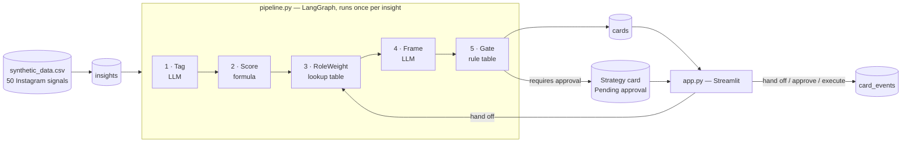
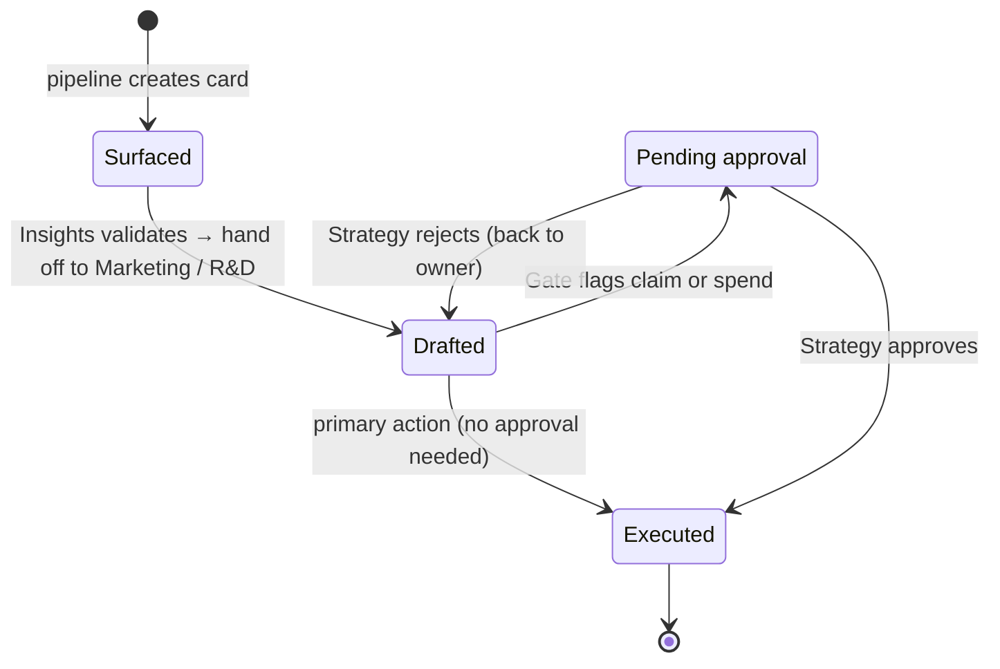
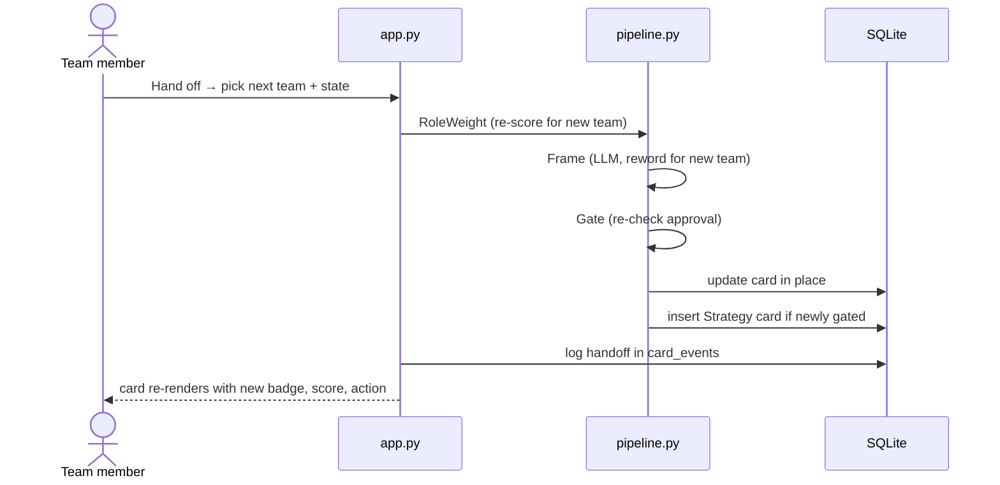

# CREWASIS — Role-Aware Recommendation Cards

> **Hazra reads. The Intelligence Suite analyzes. Winston answers. _…and the right team acts._**

A hackathon prototype for **CREWASIS**, a decision-intelligence platform for consumer brands.
It adds the missing last step, going from *"here's an insight"* to *"here's the next action, owned by the right team,
approved by a person"*.

**Team 2 · Case study: Instagram · Demo brand: GlowNest (fictional skincare/wellness)**

---

## 1. The problem

Several people share one Instagram business account. Meta Business Suite gives them different roles
(Admin, Editor, Moderator, Analyst), but **Instagram's recommendations treat the whole account as one person**.
The writer, the moderator, the analyst and the person who approves spending all see the same feed, even though
each one needs something different.

CREWASIS has the same risk. A brand's **Marketing, Insights, R&D and Strategy** teams all use it, and if every team
gets the same insight with the same wording, the insight sits there and nobody acts on it.

## 2. The idea in one sentence

> **The same evidence is shown to every team, framed for each team's job, and each card moves between teams
> until the action is done. Anything risky needs a person to approve it first.**

We take two things Instagram gets right: **scoring from many signals** and **fast, visible feedback**.
We avoid its blind spot of **treating the account, not the person, as the unit**.

---

## 3. How this maps to the judging criteria

| Criterion | Weight | What earns the points in this build |
|---|---|---|
| **Vision** | 30% | Fills the "acts" gap in CREWASIS's own story (Hazra → Winston → **the right team acts**). Clear roadmap from demo to self-learning, multi-source routing ([§12](#12-roadmap)). Humans stay in control at every stage. |
| **Customer impact** | 25% | Cards end in an **action with an owner**, not a chart. A metrics bar shows signals actioned, approvals waiting and hand-offs needed to reach execution. Every number traces back to its source row. |
| **Feasibility** | 15% | Runs end to end on a laptop with SQLite and Streamlit. Scoring and approval are plain Python you can check by hand. If there's no API key or the LLM fails, **offline mode** falls back to templates. The pipeline runs once and results are cached, so no live LLM calls happen during the demo. |
| *Remaining 30%* | — | Check the Hackathon Brief for the other criteria (likely innovation and demo/storytelling). The pitch order in [§11](#11-demo-script-5-minutes) follows the brief's five deliverables. |

---

## 4. System overview



| Layer | Tech | Why |
|---|---|---|
| Data | `synthetic_data.csv` (50 rows) | No real Instagram API. Synthetic data is expected and we say so in the pitch. |
| Storage | SQLite via built-in `sqlite3` | A single file with no server and no ORM. |
| Pipeline | LangGraph, 5 small steps | Each step does one job and can be checked on its own. It is not a multi-agent system. |
| LLM | OpenAI API behind a thin wrapper, swappable to Anthropic | Used for **wording only** (Tag, Frame). Never used for ranking or approval. |
| UI | Streamlit | A clickable demo that switches between teams, built in hours. |
| Retrieval | None: the relevant row goes straight into the prompt | With 50 rows, a vector database adds risk and no value. |

---

## 5. Project structure

```
.
├── app.py               # Streamlit UI: team selector, metrics bar, card grid, hand-off / approve / execute
├── pipeline.py          # LangGraph graph (5 steps), LLM wrapper, offline template fallback
├── db.py                # SQLite schema, CSV load, card + event read/write helpers
├── scoring.py           # score formula, role-weight table, approval-gate rules, number check
├── synthetic_data.csv   # 50 synthetic GlowNest / Instagram signals
├── requirements.txt
└── README.md
```

---

## 6. Data model

### `synthetic_data.csv` → table `insights` (stored unchanged)

| column | meaning |
|---|---|
| `id` | row id |
| `brand` | always `GlowNest` |
| `platform` | always `Instagram` |
| `raw_signal` | observed signal text, e.g. *"Is the night serum safe for sensitive skin?"* |
| `mention_count` | number of mentions |
| `velocity_pct` | week-over-week change in % (can be negative) |
| `confidence` | 0–1 |
| `category` | `packaging` · `ingredient` · `sentiment` · `competitor` · `pricing` · `trend` |
| `source_type` | `comment` · `post` · `story` · `influencer` |
| `date_observed` | date |

### `cards`

| column | type | notes |
|---|---|---|
| `id` | INTEGER PK | |
| `insight_id` | INTEGER FK → `insights.id` | links back to the source row |
| `parent_card_id` | INTEGER FK → `cards.id`, nullable | set on Strategy approval cards; points to the card being approved |
| `owner_role` | TEXT | `Marketing` · `Insights` · `R&D` · `Strategy` |
| `state` | TEXT | `Surfaced` · `Drafted` · `Pending approval` · `Executed` |
| `relevance_score` | REAL | 0–1, already weighted for `owner_role` |
| `evidence` | TEXT | cites the raw signal and its numbers |
| `suggested_action` | TEXT | next step worded for the owning team |
| `requires_approval` | BOOLEAN | set by the Gate |
| `created_at`, `updated_at` | TIMESTAMP | |

### `card_events` (history of every move, used for traceability and the metrics bar)

| column | type | notes |
|---|---|---|
| `id` | INTEGER PK | |
| `card_id` | INTEGER FK → `cards.id` | |
| `event` | TEXT | `created` · `handoff` · `approved` · `rejected` · `executed` |
| `from_role`, `to_role` | TEXT | |
| `from_state`, `to_state` | TEXT | |
| `at` | TIMESTAMP | |

---

## 7. Pipeline: how one signal becomes a card

Each step runs once per insight, in order. **Exactly 2 LLM calls per insight** (Tag and Frame). Everything else is
plain Python that you can check by hand.

### Step 1 · Tag (LLM, JSON output)
- **In:** `raw_signal`, `category`, `source_type`, plus the row's numbers
- **Out:** `{ "evidence": "...", "owner_role": "Marketing|Insights|R&D|Strategy" }`
- **Guardrail:** `scoring.check_numbers()` checks that every number in `evidence` actually appears in the source row.
  If one doesn't, the card uses the template evidence instead. **No made-up numbers reach the screen.**

### Step 2 · Score (formula)
```
base = normalize(mention_count) × (1 + velocity_pct / 100) × confidence      → clipped to 0–1
normalize(x) = (x − min) / (max − min) across all 50 rows
```
Every input and intermediate value is logged.

### Step 3 · RoleWeight (lookup table)
`relevance_score = clip(base × WEIGHTS[category][owner_role], 0, 1)`

| category | Marketing | Insights | R&D | Strategy |
|---|---|---|---|---|
| packaging | 0.8 | 1.0 | **1.3** | 1.0 |
| ingredient | 0.9 | 1.0 | **1.3** | 1.0 |
| sentiment | **1.2** | **1.2** | 0.8 | 1.0 |
| competitor | 1.0 | 1.1 | 0.9 | **1.3** |
| pricing | 1.0 | 1.0 | 0.7 | **1.3** |
| trend | **1.2** | **1.2** | 1.0 | 1.1 |

### Step 4 · Frame (LLM)
- **In:** `evidence` + `owner_role`
- **Out:** `suggested_action`, a single imperative sentence worded for that team's job:

| Team | Its job | Example action |
|---|---|---|
| Insights | check the signal is real | "Validate the sensitive-skin spike against last month's baseline" |
| Marketing | shape what customers see | "Draft a post answering sensitive-skin questions about the night serum" |
| R&D | shape the product | "Review night-serum formulation for sensitive-skin irritants" |
| Strategy | decide on money and direction | "Decide whether to fund a sensitive-skin product line" |

### Step 5 · Gate (rule table)
`requires_approval = true` if `suggested_action` matches either rule:

| Rule | Trigger words (in `scoring.py`) | Why |
|---|---|---|
| Customer-facing claim | post, caption, campaign, announce, publish, claim, reply publicly | brand and regulatory risk |
| Budget spend | budget, spend, fund, paid, boost, sponsor, influencer, launch | money |

If the gate triggers, the pipeline also creates a **Strategy card** in `Pending approval`, with
`parent_card_id` pointing at the original card.

### Worked example (for the judges)

Signal: *"Is the night serum safe for sensitive skin?"*. `ingredient`, 180 mentions (min 20, max 500), +47%, confidence 0.91.

```
normalize(180) = (180 − 20) / (500 − 20)  = 0.333
× (1 + 47/100)                            = 0.490
× 0.91                                    = 0.446   ← base score

R&D       0.446 × 1.3 = 0.580   → ranks near the top of the R&D view
Insights  0.446 × 1.0 = 0.446
Marketing 0.446 × 0.9 = 0.401   → ranks lower for Marketing
```

### Offline mode
If `OPENAI_API_KEY` is missing, `CREWASIS_OFFLINE=1` is set, or an LLM call fails, Tag and Frame fall back to
templates in `pipeline.py`:
- **evidence:** `"{mention_count} Instagram mentions of '{raw_signal}', {velocity_pct:+}% week over week, confidence {confidence}."`
- **owner_role:** default by category (packaging/ingredient → R&D, sentiment/trend → Marketing, competitor/pricing → Strategy)
- **action:** one sentence template per team

The demo keeps working even without an internet connection.

---

## 8. Card lifecycle: how work moves between teams



| State | Usually owned by | What they do | Buttons on the card |
|---|---|---|---|
| **Surfaced** | Insights (or whoever Tag picked) | Check the evidence is real | Primary action · Hand off |
| **Drafted** | Marketing / R&D | Shape the action | Primary action · Hand off |
| **Pending approval** | Strategy | Approve or reject | Approve · Reject |
| **Executed** | — | Action ran (simulated) and outcome logged | read-only |

**Rules enforced in `app.py`:**
- A card with `requires_approval = true` **can't be executed** until its Strategy card is approved.
  Until then its primary button reads *"Awaiting Strategy approval"* and is disabled.
- **Approve** → the Strategy card and its original card both move to `Executed`.
- **Reject** → the original card goes back to `Drafted` with its current owner.
- Every change writes a row to `card_events`.

### Hand-off flow (1 LLM call)



Hand-off re-runs **RoleWeight, Frame and Gate**. The score is recalculated for the new team, which costs no LLM calls.

---

## 9. UI

```
┌──────────────────────────────────────────────────────────────────────┐
│ CREWASIS · GlowNest               View as: [Marketing ▾]             │
├──────────────────────────────────────────────────────────────────────┤
│ Signals 50 │ In progress 18 │ Awaiting approval 4 │ Executed 7 │     │
│ Avg hand-offs to execution 1.6                                       │
├──────────────────────────────────────────────────────────────────────┤
│ ┌───────────────────────────────┐ ┌───────────────────────────────┐  │
│ │ [Marketing] [Drafted]    0.58 │ │ [Marketing] [Surfaced]   0.51 │  │
│ │ 180 Instagram mentions of ... │ │ ...                           │  │
│ │ → Draft a post answering ...  │ │                               │  │
│ │ ⚠ Requires approval           │ │                               │  │
│ │ [Awaiting Strategy approval]  │ │ [Draft a caption for ...]     │  │
│ │ Hand off: [R&D ▾][Drafted ▾] ⏎│ │ Hand off: [...]               │  │
│ │ ▸ Show source & score         │ │ ▸ Show source & score         │  │
│ └───────────────────────────────┘ └───────────────────────────────┘  │
└──────────────────────────────────────────────────────────────────────┘
```

- **Team selector** switches between Marketing, Insights, R&D and Strategy. Cards are sorted by `relevance_score`, highest first.
- **Metrics bar** is calculated from `cards` and `card_events`. This is the customer-impact evidence.
- **Card** shows the team badge, state badge, score, evidence, suggested action and a "Requires approval" flag.
- **"Show source & score"** opens the raw CSV row, the full formula breakdown and the card's event history.
- **Strategy view** puts `Pending approval` cards first, with **Approve / Reject** buttons.
- **Colours:** CREWASIS brand, `#7D66EC` primary, `#1A1825` dark, `#FFFFFF`.

---

## 10. Setup

Requires **Python 3.11+**.

```bash
pip install -r requirements.txt
```

```bash
export OPENAI_API_KEY=sk-...
```

```bash
streamlit run app.py
```

On first launch the app loads the CSV and runs the pipeline **only if `cards` is empty** (100 LLM calls in total).
Later launches reuse `crewasis.db` and make no LLM calls.

| Variable | Purpose |
|---|---|
| `OPENAI_API_KEY` | default LLM provider |
| `LLM_PROVIDER=anthropic` + `ANTHROPIC_API_KEY` | switch to Anthropic |
| `CREWASIS_OFFLINE=1` | skip the LLM and use templates |

To start over from scratch:
```bash
rm crewasis.db
```

> **Before demo day:** run the pipeline once and keep `crewasis.db`. The demo then makes no live LLM calls
> during start-up, and the only live calls are hand-offs.

### What to check first
1. `sqlite3 crewasis.db "SELECT owner_role, state, COUNT(*) FROM cards GROUP BY 1,2;"` returns 50 cards plus the Strategy approval cards.
2. Restart the app. It loads instantly and the logs show no LLM calls.
3. Open **Show source & score** on any card and recompute its score by hand.
4. Compare the Marketing and R&D views. Ingredient and packaging signals should rank higher for R&D.
5. Try to execute a gated Marketing card. It stays blocked until Strategy approves it.
6. Hand a card from Insights to Marketing. The score, action and approval flag all update, and the event is logged.
7. Run with `CREWASIS_OFFLINE=1`. The app still works end to end.

---

## 11. Demo script (5 minutes)

Follows the brief's order: **problem → why it matters → solution → prototype → next steps**.

1. **Problem (30s):** Instagram shows one shared business account the same feed, whoever is looking at it.
2. **Why it matters (30s):** at a brand, insights nobody owns never get acted on. CREWASIS risks the same gap.
3. **Solution (30s):** the one-sentence idea from [§2](#2-the-idea-in-one-sentence), plus *"…and the right team acts."*
4. **Prototype (3 min):**
   - Open **Insights** and pick the top card. Open *Show source & score* and read the formula aloud.
   - **Hand off to Marketing.** The wording changes to "Draft a post…" and the card is flagged **Requires approval**.
   - Try to execute it. It's blocked.
   - Switch to **Strategy** and **Approve** it. The card flips to **Executed** and the metrics bar updates.
   - Switch to **R&D** and show the same kind of signal ranked higher and worded as a formulation review.
5. **Next steps (30s):** the roadmap in [§12](#12-roadmap).

---

## 12. Roadmap

| Phase | What changes | Human role |
|---|---|---|
| **Now (this demo)** | Instagram signals, 4 teams, rule-based approval | approves anything customer-facing or involving spend |
| **Next** | More sources (reviews, TikTok, competitor launches) feed the same cards | same |
| **Then** | Role weights **learn from approve/reject history** in `card_events` (Instagram's feedback loop, applied per team) | reviews how the weights change |
| **Later** | Low-risk actions (internal reviews, research tasks) run automatically | still approves every claim and every spend |

**Success metrics for a pilot:** % of surfaced signals that get executed · median hand-offs to execution ·
approval turnaround time · % of cards whose evidence passes the number check.

---

## 13. Judge Q&A cheat sheet

| Question | Answer |
|---|---|
| *Why not let the LLM rank?* | Rankings need to be explainable. The formula and weight table are on screen and anyone can recompute them. The LLM only writes the wording. |
| *What if the LLM invents a number?* | `check_numbers()` rejects any evidence whose numbers aren't in the source row and falls back to the template. |
| *Why no RAG or vector database?* | With 50 rows, putting the row straight into the prompt is exact and has no retrieval errors. We'd add retrieval at thousands of documents. |
| *Who stays in control?* | Strategy approves every customer-facing claim and every spend. The code blocks execution until then. |
| *Are the weights arbitrary?* | They're a starting point that anyone can read. The roadmap learns them from approve/reject history. |
| *Is the data real?* | No, it's synthetic by design. The brief rules out real Instagram API access. |
| *What's the keyword gate's limit?* | An action worded to avoid the trigger words can slip through. The next step is labelling actions by type and having people review those labels. |

---

## 14. Constraints and non-goals

- No real Instagram API calls. `synthetic_data.csv` is the only data source.
- Exactly 2 LLM calls per insight at start-up (Tag, Frame) and 1 per hand-off (Frame). No extra agent steps.
- No vector search, no ORM, no auth, no multi-user sessions. It's a single-user demo.
- "Executed" is simulated. No post or spend actually happens.
